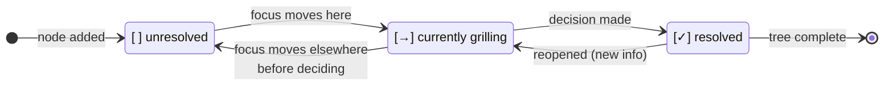

<what-to-do>

Interview me relentlessly about every aspect of this plan until we reach a shared understanding. Walk down each branch of the design tree, resolving dependencies between decisions one-by-one. For each question, provide your recommended answer.

Ask the questions one at a time.

If a question can be answered by exploring the codebase, explore the codebase instead.

Before the first question, print the design tree (see *Design tree* below). Reprint it whenever the shape or status actually changes.

</what-to-do>

<supporting-info>

## Design tree

Print the design tree at the start of the session — the decisions and sub-decisions you've identified, with a status marker on each:

- `[ ]` unresolved
- `[→]` currently being grilled
- `[✓]` resolved

Example:

```
Design tree
├── [→] Auth strategy
│   ├── [ ] Session storage (cookie vs JWT)
│   └── [ ] Refresh-token rotation
├── [ ] Persistence layer
│   ├── [ ] Primary store
│   └── [ ] Migration path from current schema
└── [ ] Rollout
    ├── [ ] Feature-flag gate
    └── [ ] Backfill plan
```

Reprint the tree whenever it changes: a node is resolved, a new branch is discovered, the focus moves to a new node, or scope shifts. Don't reprint between every question — only when the shape or status actually changes. Always reprint the full tree, not a diff, so progress is visible at a glance.

Status lifecycle for a single node:



</supporting-info>
