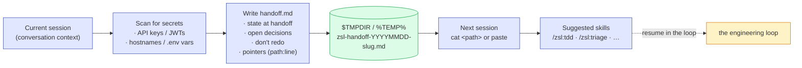

# Handoff

Write a handoff document summarising the current conversation so a fresh agent can continue the work without re-deriving context from scratch.



## Where to save

The OS temp directory — **not** the current workspace. The handoff is ephemeral session metadata, not a project artifact.

- macOS / Linux: `$TMPDIR/zsl-handoff-<YYYYMMDD>-<short-slug>.md` (fallback `/tmp/...`)
- Windows: `%TEMP%\zsl-handoff-<YYYYMMDD>-<short-slug>.md`

Tell the user the absolute path after writing so they can hand it to the next session via `cat <path>` or paste.

If a handoff file with the same slug already exists for today, **read it first** before writing so existing content is preserved or appended to, not clobbered.

## What goes in

Lead with what the next agent actually needs in the first 30 seconds. Cut anything they can reconstruct themselves.

1. **One-paragraph summary** of what this session was about and where it left off — written so a cold reader can orient in three sentences.
2. **State at handoff** — the concrete thing the next session inherits. Branch name + last commit sha (`git rev-parse --abbrev-ref HEAD` / `git rev-parse HEAD`), unpushed work, open worktrees, halted RCAs, anything mid-flight. Reference, don't copy.
3. **Open questions / pending decisions** — anything the user and this session debated without resolving. Each as a bullet with the option list, not just the question.
4. **Suggested skills for next session** — which `/zsl:<skill>` calls the next agent should reach for first, in order. Be specific: `/zsl:tdd <NN>` not just `/zsl:tdd`.
5. **What NOT to redo** — work that's already complete (commits landed, PRs opened, slices closed). Saves the next agent from re-reviewing finished ground.
6. **Pointers, not duplicates** — for anything that already exists in a durable artifact (PRD, ADR, issue body, commit message, file in repo), reference it by `<path>:<line>` or URL. Never paste the full body.

## What stays out

Skip aggressively. The point is compaction.

- Conversation transcripts. The next agent doesn't need to read your back-and-forth.
- Code listings already in the repo. Refer to `file:line`.
- Issue bodies / PRD bodies that are on the tracker. Refer to `#123` or the path.
- Tool-call output that wasn't load-bearing for the conclusion.
- Apologies, hedges, "I'm going to do X" announcements — the artifact is the record, not the running commentary.

## Redaction

**Before writing, scan for and redact:**

- API keys, tokens, passwords, OAuth credentials, signed URLs — any string that looks like `sk-…`, `ghp_…`, `eyJ…` (JWT), `xox[abp]-…` (Slack), AWS access-key patterns
- Personally identifiable information beyond what's already in the repo (emails, phone numbers, names of customers/users mentioned in passing)
- Internal hostnames, IPs, S3 bucket names, database connection strings
- Anything under `.env*` that the conversation surfaced

When in doubt, redact. Replace with `<redacted: kind>` (e.g. `<redacted: api-key>`). If the redaction makes a step incomprehensible, the next session can ask the user for the value; that's safer than leaking it into a tmp file.

## Argument handling

If the user passed an argument to `/handoff`, treat it as a description of what the next session will focus on. Tailor the **Suggested skills** and **State at handoff** sections to that focus. The other sections still cover the broader conversation, but the spotlight shifts.

If no argument was passed, write a general-purpose handoff covering everything substantive in the session.

## Template

```markdown
# Handoff — <YYYY-MM-DD HH:MM> — <one-line topic>

> Generated by `/zsl:handoff`. Read this once, then start work — don't re-derive what's already settled.

## Summary

<3 sentences: what this session was about, what got done, where it stopped>

## State at handoff

- Branch: `<branch-name>` (last sha: `<short-sha>`)
- Pushed: yes / no
- Open PRs: <#N or none>
- Halted operations: <RCA path or none>
- Worktrees: <paths or none>

## Done — don't redo

- <one-line per completed item, with the commit/PR/issue link>

## Open questions / pending decisions

- **<decision>** — options considered: A (…), B (…). Leaning <X> because <reason>. Needs user to confirm.
- **<question>** — context: <file:line or PRD ref>. Asked, not yet answered.

## Suggested skills for the next session

In order:

1. `/zsl:<skill> <args>` — <one line: why this first>
2. `/zsl:<skill> <args>` — <one line>
3. `/zsl:<skill> <args>` — <one line>

## Pointers

- PRD: <path or URL>
- Relevant ADRs: <path>
- Recent commits worth reading: `<sha>` (`<subject>`)
- Files most likely to need attention: `<file>:<line-range>`
```

## Tone

The handoff is for a stranger. They have no conversational context, no memory of your earlier debates, no idea who's the user and who's the agent. Write so a cold read makes them productive in 30 seconds. If a section needs scaffolding to be understandable, the section is wrong — rewrite the section, don't pad it with explainer.
