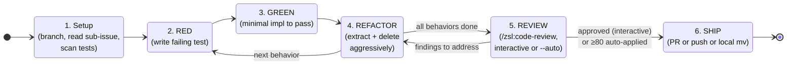

# Test-Driven Development

## Philosophy

**Core principle**: Tests should verify behavior through public interfaces, not implementation details. Code can change entirely; tests shouldn't.

**Good tests** are integration-style: they exercise real code paths through public APIs. They describe _what_ the system does, not _how_ it does it. A good test reads like a specification - "user can checkout with valid cart" tells you exactly what capability exists. These tests survive refactors because they don't care about internal structure.

**Bad tests** are coupled to implementation. They mock internal collaborators, test private methods, or verify through external means (like querying a database directly instead of using the interface). The warning sign: your test breaks when you refactor, but behavior hasn't changed. If you rename an internal function and tests fail, those tests were testing implementation, not behavior.

See [tests.md](tests.md) for examples and [mocking.md](mocking.md) for mocking guidelines.

## Anti-Pattern: Horizontal Slices

**DO NOT write all tests first, then all implementation.** This is "horizontal slicing" - treating RED as "write all tests" and GREEN as "write all code."

This produces **crap tests**:

- Tests written in bulk test _imagined_ behavior, not _actual_ behavior
- You end up testing the _shape_ of things (data structures, function signatures) rather than user-facing behavior
- Tests become insensitive to real changes - they pass when behavior breaks, fail when behavior is fine
- You outrun your headlights, committing to test structure before understanding the implementation

**Correct approach**: Vertical slices via tracer bullets. One test → one implementation → repeat. Each test responds to what you learned from the previous cycle. Because you just wrote the code, you know exactly what behavior matters and how to verify it.

```
WRONG (horizontal):
  RED:   test1, test2, test3, test4, test5
  GREEN: impl1, impl2, impl3, impl4, impl5

RIGHT (vertical):
  RED→GREEN: test1→impl1
  RED→GREEN: test2→impl2
  RED→GREEN: test3→impl3
  ...
```

## Flags

- `--no-ship` — skip step 6 (Ship it) and switch step 5 (Review) into autonomous mode (`/code-review --auto`). After review and any auto-applied fixes commit, stop and report back: branch name (`git rev-parse --abbrev-ref HEAD`), last commit sha (`git rev-parse HEAD`), a one-paragraph summary of the changes, and a **Deferred review findings** section listing the 60–79 confidence findings that weren't auto-applied. Do not push, do not open a PR, do not update the project board's "in review" Status. Used by `/tdd-parallel` so the orchestrator can integrate slice branches locally and ship a single consolidated PR. Step 1's "in progress" Status update still happens — the work is real, only the ship step is deferred. Also engages **Progress heartbeat** (see below) — the orchestrator depends on it for live status.

## Progress heartbeat

Under `--no-ship` (running inside `/tdd-parallel`), emit one JSON line to `.tdd-progress.jsonl` in the current working directory at each phase below. The orchestrator tails the file to render live progress; without these lines it sees nothing until you return, and a silent slice looks indistinguishable from a hung one.

Schema: `{"slice": <num>, "ts": "<ISO-8601 UTC>", "phase": "<phase>", "note": "<short>"}`. `slice` is the input issue number, passed through verbatim.

Phases (in order; `red` / `green` repeat per cycle):

- `started` — immediately after pre-flight, before planning.
- `planned` — once the behavior list is decided. `note`: `"N behaviors: ..."`.
- `red` — each failing test written. `note`: `"<n>/<N>: <behavior>"`.
- `green` — each test now passing.
- `refactor` — after each refactor step that touched files. `note`: what was extracted/renamed.
- `committed` — after each commit. `note`: short sha.
- `reviewed` — after the `/code-review` pass completes. `note`: `"auto-applied N, deferred M"` (AFK) or `"approved N fixes"` (interactive).
- `done` — final phase, just before returning to the parent.
- `escalating` — instead of `done`, if you escalate. `note`: one-line question.
- `error` — instead of `done`, if you halt. `note`: one-line cause.

Emit via `bash -c "printf '%s\n' '<json>' >> .tdd-progress.jsonl"` — one `printf` per line, no buffering, append-only. Without `--no-ship`, emission is optional and harmless.

## Step graph



Heartbeat phases (for `/zsl:tdd-parallel`'s orchestrator): `setup`, `red`, `green`, `refactor`, `reviewed`, `shipped`.

## Workflow

### 1. Planning

**Pre-flight: no-arg discovery (local-markdown trackers only).** If no issue identifier was passed AND `docs/agents/issue-tracker.md` describes a local-markdown tracker (H1 reads `# Issue tracker: Local Markdown`, or the file describes the `.scratch/<feature>/issues/` convention), discover what's ready to pick up instead of asking:

1. List every `.scratch/<feature>/issues/*.md` file across all features. Exclude `issues/done/` and any feature already under `.scratch/done/` — those are archived.
2. For each open issue, parse its `## Blocked by` section. A reference is satisfied if the cited file (or the cited number under the same feature's `issues/`) resolves to a path inside `issues/done/`. A reference that doesn't resolve to any file is a malformed issue — surface it to the user but don't crash.
3. Present three buckets to the user:
   - **Ready to grab** (numbered): feature slug, issue number, title, and a one-line summary (first non-heading line of the issue body). Sort by feature, then issue number.
   - **Pending future waves**: blocked open issues + the `Blocked by` references each is still waiting on. Shown for context only — not pickable.
   - **Features fully archived but not closed**: features whose `issues/` directory contains only the `done/` subdirectory. Suggest running the feature-level close from step 6 against any of these before picking new work.
4. Let the user pick by number or by path. Use that pick as the issue identifier for the remaining pre-flights and the rest of the workflow.

If the picked-from set is empty (no open issues anywhere under `.scratch/`), say so and stop — there's nothing to do.

If invoked with no argument against a GitHub/GitLab/other tracker, fall through to the next pre-flight, which will refuse for lack of an identifier. (Auto-discovery for remote trackers is out of scope here — use `/triage` to find work-ready issues.)

**Pre-flight: refuse container issues.** If you were given an issue identifier as input (or picked one in the previous pre-flight), fetch it and check whether it has open sub-issues. If it does, it's a tracking parent (likely a PRD), not a unit of work. Refuse and tell the user to run `/to-issues` to break it down first, then `/tdd` against one of the leaf children.

**Pre-flight: signal "in progress" on the project board (if configured).** If you were given an issue identifier *and* `docs/agents/project-board.md` exists, update the issue's project item Status to the option mapped to "work begins" (typically `In progress`). Use the same lookup-then-update procedure documented in `triage/SKILL.md` step 6: fetch the project item via `gh api graphql` filtered by the configured project node ID, then `updateProjectV2ItemFieldValue` with the mapped Status option ID. If the issue isn't on the configured project, log and continue. Best-effort — failure to update Status doesn't block the TDD work. Skip entirely if `docs/agents/project-board.md` doesn't exist or you weren't given an issue identifier.

When exploring the codebase, use the project's domain glossary so that test names and interface vocabulary match the project's language, and respect ADRs in the area you're touching.

Before writing any code:

- [ ] Confirm with user what interface changes are needed
- [ ] Confirm with user which behaviors to test (prioritize)
- [ ] Identify opportunities for [deep modules](deep-modules.md) (small interface, deep implementation)
- [ ] Design interfaces for [testability](interface-design.md)
- [ ] List the behaviors to test (not implementation steps)
- [ ] Get user approval on the plan

Ask: "What should the public interface look like? Which behaviors are most important to test?"

**You can't test everything.** Confirm with the user exactly which behaviors matter most. Focus testing effort on critical paths and complex logic, not every possible edge case.

### 2. Tracer Bullet

Write ONE test that confirms ONE thing about the system:

```
RED:   Write test for first behavior → test fails
GREEN: Write minimal code to pass → test passes
```

This is your tracer bullet - proves the path works end-to-end.

### 3. Incremental Loop

For each remaining behavior:

```
RED:   Write next test → fails
GREEN: Minimal code to pass → passes
```

Rules:

- One test at a time
- Only enough code to pass current test
- Don't anticipate future tests
- Keep tests focused on observable behavior

### 4. Refactor

After all tests pass, look for [refactor candidates](refactoring.md):

- [ ] Extract duplication
- [ ] **Delete aggressively** — every refactor pass should remove something. Hunt for: dead code from over-eager early cycles, unused imports, debug statements (`console.log`, `print`, `dbg!`), commented-out blocks, comments that explain *what* the code does (rewrite the code instead). Bring net additions down where you can — TDD that only adds is half-done.
- [ ] Deepen modules (move complexity behind simple interfaces)
- [ ] Apply SOLID principles where natural
- [ ] Consider what new code reveals about existing code
- [ ] Run tests after each refactor step

**Never refactor while RED.** Get to GREEN first.

### 5. Review

After refactor lands and tests are still green, run `/code-review` against the slice diff to catch what the author (you) missed.

- **Interactive** (default): runs with the approval gate. Apply the fixes you accept, re-run tests, commit fixes via `/commit` (same discipline as step 6).
- **AFK** (`--no-ship`): runs as `/code-review --auto`. High-confidence (≥80) fixes auto-apply as a separate commit (subject `review: <summary>`) — `/code-review` commits directly here rather than going through `/commit`, so the AFK contract isn't broken by `/commit`'s interactive prompts. Mid-confidence (60–79) findings get captured for the return summary under a **Deferred review findings** section with `file:line` refs.

If `/code-review` halts (lint or tests fail after auto-fix and the review commit was reverted), escalate per the AFK contract — return early with the failure cause.

Emit a `reviewed` heartbeat after the review pass completes.

### 6. Ship it

**Skip this entire step if `--no-ship` was passed.** Stop after the review step's final commit and report back: branch name, last commit sha, one-paragraph summary, plus any deferred 60–79 review findings. The orchestrator (`/tdd-parallel`) will integrate the branch and ship a consolidated PR.

Once tests are green and refactored, ship the slice. The repo's workflow is defined in `docs/agents/ship-style.md` (written by `/setup-zsl-superpowers`) — read it before doing anything.

- **Always commit via `/commit`** — never craft commits yourself. The commit body must reference both the sub-task and the parent issue so git history is navigable. Use `#<num>` for GitHub/GitLab (auto-linked in the UI), paths for local-markdown trackers (e.g. `.scratch/auth/issues/03-add-oauth.md`), or full URLs for other trackers:

  ```
  <subject>

  Sub-task: #<sub-task>
  Parent: #<parent>
  ```

- **Close the sub-task on merge.** How depends on `docs/agents/issue-tracker.md` (check its H1 — `# Issue tracker: <Name>`):
  - **GitHub / GitLab:**
    - PR-style — put `Closes #<sub-task>` in the PR body, alongside the same sub-task/parent references.
    - Direct-push — put `Closes #<sub-task>` in the commit body itself (replaces the `Sub-task:` line).

    The tracker auto-closes the parent once its last child closes (the sub-issue link was set at `/to-issues` time).
  - **Local markdown** (issue is a file under `.scratch/<feature>/issues/`):
    - Update the `Status:` line near the top of the issue file to its final state — typically `shipped`. Use `wontfix` only if the maintainer is closing without delivery; since you just got the tests green, default to `shipped`.
    - `git mv .scratch/<NNN>-<feature-slug>/issues/<NN>-<slug>.md .scratch/<NNN>-<feature-slug>/issues/done/<NN>-<slug>.md`. The filename stays the same — `NN` is permanent and unique across both folders.
    - Include both the `Status:` edit and the `git mv` in the same commit as the slice's code change so the close is atomic with the work that earned it. (The commit ref convention above already accommodates path-style sub-task/parent references.)
    - **Feature-level close (optional, prompt first):** after the `git mv`, list `.scratch/<NNN>-<feature-slug>/issues/` and check whether any `.md` files remain outside the `done/` subdirectory. If none, tell the maintainer every issue in the feature is now archived and ask whether to archive the feature itself: `git mv .scratch/<NNN>-<feature-slug>/ .scratch/done/$(date +%Y%m%d)-<NNN>-<feature-slug>/`. The date prefix orders archived features chronologically (`ls .scratch/done/` shows close order); the feature number stays embedded so number-based lookup keeps working. Don't move it without confirmation — the maintainer may want to spin up a follow-up issue first.
- **Confirm with the user** before opening a PR or pushing to the default branch.
- **Signal "in review" on the project board (PR-style only, if configured).** If `docs/agents/project-board.md` exists *and* the ship style is PR, update the issue's project item Status to the option mapped to "PR opened" (typically `In review`) once the PR is open. The project's existing `Auto-close issue` workflow will move Status to `Done` automatically when the PR merges and closes the issue. In direct-push mode, no skill-driven Status update is needed at ship time — the closing commit triggers the same Auto-close workflow directly.

If `docs/agents/ship-style.md` doesn't exist, run `/setup-zsl-superpowers` first.

## Checklist Per Cycle

```
[ ] Test describes behavior, not implementation
[ ] Test uses public interface only
[ ] Test would survive internal refactor
[ ] Code is minimal for this test
[ ] No speculative features added
```
