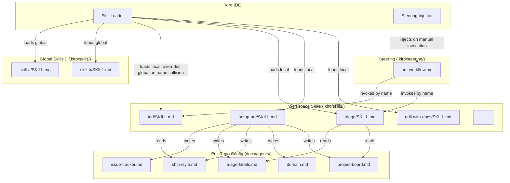

# Design Document: Arc Kiro Workflow Personalization

## Overview

This document describes the design for personalizing the Arc Skills workflow inside a Kiro IDE workspace. The system is a collection of markdown-based skill files and a steering file — there is no compiled code, no runtime, and no build step. "The system" is the set of conventions, file layouts, and agent behaviors that Kiro reads and executes.

The design covers:

- How skills are structured, loaded, and overridden
- How the steering file orchestrates phases
- How each major skill (setup, grill, tdd, triage) is customized
- How global vs per-repo skills are managed
- How the personal workflow is documented

Because the system is entirely markdown-driven, most "components" are file conventions rather than code modules. The design focuses on the contracts between files, the validation rules that keep them consistent, and the agent behaviors that implement each requirement.

## Architecture

The system has three layers:



The key architectural decisions:

- **Skills are pure markdown.** No code is executed by the skill files themselves; Kiro's agent reads them as instructions.
- **Skills reference each other by `name` front-matter value**, not by directory path. This decouples the directory layout from the invocation contract.
- **Local skills shadow global skills** on name collision. This is Kiro's built-in resolution order.
- **Per-repo config lives in `docs/agents/`**, written by `setup-arc` and read by `tdd`, `triage`, and `tdd-parallel`.
- **The steering file is the single source of truth for phase order.** Phases execute in document order; the agent reads the file top-to-bottom.

## Components and Interfaces

### Skill File Contract

Every skill is a directory under `.kiro/skills/<name>/` (or `~/.kiro/skills/<name>/`) containing:

```
<name>/
├── SKILL.md          # required — front matter + instructions
└── <resource>.md     # optional — bundled supporting documents
```

The `SKILL.md` front matter:

```yaml
---
name: <kebab-case-identifier>   # required — used for invocation and override resolution
description: <one-line>         # required — shown in skill listings
disable-model-invocation: true  # optional — suppresses Kiro's default model call
---
```

Relative links in `SKILL.md` (e.g. `[AGENT-BRIEF.md](./AGENT-BRIEF.md)`) resolve to files in the same directory. A missing target is a validation error. **Validation runs on invocation** — when the agent loads a skill to execute it, it checks that all relative links in the `SKILL.md` body resolve to existing files in the skill directory. If any link is broken, the agent surfaces the `missing-resource` error before executing the skill instructions. Validation also runs during the audit process (Requirement 1), but invocation-time validation is the primary enforcement point.

**Hot-reload guarantee (platform behavior):** Kiro reads skill files on each invocation. Editing a `SKILL.md` or any bundled resource file takes effect on the next invocation — no IDE restart is required. This is a Kiro platform guarantee, not something the skill author needs to implement.

**Skill removal isolation:** Removing a skill directory from `.kiro/skills/` disables that skill in the current workspace. Skills in this system do not declare hard dependencies on other skills — they reference each other by `name` in prose instructions, not via a dependency graph. Removing a skill therefore has no runtime effect on other skills. The only impact is that any steering file phase or other skill instruction that invokes the removed skill by name will produce an unknown-skill-ref warning at validation time (see Steering Validation Result). The user is responsible for updating those references after removal.

**Important:** Removing a skill from `.kiro/skills/` does not remove it from `~/.kiro/skills/`. If a global copy exists, Kiro will continue to load the global version after the local copy is removed. To fully disable a skill across all workspaces, the user must also remove it from `~/.kiro/skills/<name>/`.

### Steering File Contract

The steering file lives at `.kiro/steering/arc-workflow.md` with front matter:

```yaml
---
inclusion: manual   # or: always | fileMatch
---
```

The `inclusion` field controls when Kiro injects the steering file into the agent's context:

| Value | Behavior |
|-------|----------|
| `manual` | Only injected when the user explicitly references it (e.g. `#arc-workflow`) |
| `always` | Injected automatically into every agent session in this workspace |
| `fileMatch` | Injected when any file matching the `match` glob pattern is open in the editor |

Changing `inclusion` from `manual` to `always` is a plain text edit — no restart required. The change takes effect on the next agent session.

Phase headings follow the pattern `### Phase N — Name` (or `### Phase N — Name (optional)`). Each phase body invokes a skill by its `name` front-matter value. A `## Rules` section at the end declares global constraints applied across all phases.

**Rules interpretation:** The `## Rules` section contains free-form prose instructions. There is no structured rule syntax, no enforcement engine, and no parsing — the agent reads the section as natural language and applies the constraints as behavioral guidelines throughout the session. Rules are advisory in the same way that all skill instructions are advisory: the agent is expected to follow them, but there is no runtime mechanism that prevents violation. Users should write rules as clear, imperative statements to maximize compliance.

### Skill Resolution Order

When Kiro loads skills, it merges two directories:

1. `~/.kiro/skills/` — global skills
2. `.kiro/skills/` — workspace-local skills

If both directories contain a skill with the same `name` front-matter value, the workspace-local version wins. The directory name is irrelevant to resolution; only the `name` field matters.

### Per-Repo Config Files

| File | Written by | Read by |
|------|-----------|---------|
| `docs/agents/issue-tracker.md` | `setup-arc` | `to-issues`, `to-prd`, `triage` |
| `docs/agents/triage-labels.md` | `setup-arc` | `triage`, `tdd-parallel` |
| `docs/agents/ship-style.md` | `setup-arc` | `tdd`, `tdd-parallel` |
| `docs/agents/domain.md` | `setup-arc` | `improve-codebase-architecture`, `diagnose`, `tdd` |
| `docs/agents/project-board.md` | `setup-arc` | `triage`, `tdd`, `tdd-parallel` |

### Skill Audit Interface

The audit process (Requirement 1) is a manual agent-driven comparison, not an automated tool. The agent:

1. Lists all directories under `.kiro/skills/`
2. For each, reads the `SKILL.md` front matter and body
3. Checks whether a matching directory exists under `skills/` (the original source). If `skills/` does not exist in the repo, the "diff" column is marked "no source available" for all skills — the audit still runs and produces the full table.
4. Compares against the source in `skills/` (if present). A "difference" is defined at two levels:
   - **Front matter change** — `name` or `description` field differs from the source
   - **Body change** — any content difference in the markdown body below the front matter delimiter
   Both levels are reported independently. A skill with only a body change (e.g. instructions reworded for Kiro) is marked "body changed". A skill with a name change is marked "front matter changed" and flagged as high-impact since steering file references may be broken.
5. Produces a table: skill name | description | status (keep/modify/drop) | steering-file-referenced (yes/no) | diff-from-source (front-matter-changed/body-changed/unchanged/no-source)

**Definition of "steering-file-referenced":** A skill is marked `yes` if its `name` front-matter value appears anywhere in the body of any phase section in the steering file. Presence in comments, the Rules section, or the file header does not count — only phase bodies.

The output is a markdown table written to the conversation, not a file.

### Setup Skill Personalization

The `setup-arc` skill is personalized by editing its bundled resource files directly. No code changes are required.

**Hard-coded defaults (Req 4.1):** The skill directory contains a `defaults.md` bundled resource file. When present, the agent reads it before running setup and uses its values to pre-fill or skip sections. Format:

```markdown
# Setup Defaults

## Issue tracker
github

## Triage labels
(use defaults)

## Domain docs
single-context

## Ship style
pull-request

## Project board
skip
```

Any section present in `defaults.md` is applied without prompting the user. Sections absent from `defaults.md` are asked interactively as normal. If `defaults.md` does not exist, or exists but is empty, all five sections are asked interactively.

The value `(use defaults)` for triage labels means: use the six canonical role strings as-is (`needs-triage`, `needs-info`, `ready-for-agent`, `ready-for-human`, `tracking`, `wontfix`). It does not read from any existing `docs/agents/triage-labels.md` — it applies the hardcoded strings. If the user wants to inherit from an existing file, they should omit the "Triage labels" section from `defaults.md` entirely so the interactive prompt fires.

**Custom templates (Req 4.3):** The seed template files in the skill directory (`issue-tracker-github.md`, `triage-labels.md`, `ship-style-pr.md`, etc.) are the templates the skill uses when writing `docs/agents/` files. The user customizes them by editing these files directly in `.kiro/skills/setup-arc/`. The skill always reads from its own bundled templates — it never falls back to originals once the user has edited them.

### Grill Skill Personalization

The `grill-with-docs` (and `grill-me`) skills are personalized via two bundled resource files in the skill directory.

**Proactive CONTEXT.md conflict scan (Req 5.2):** At the start of every `grill-with-docs` session, before asking any questions, the agent reads `CONTEXT.md` and scans the user's opening message or notes for terms that conflict with or diverge from the glossary. Any conflicts are surfaced immediately as the first output of the session — e.g. "Your glossary defines 'cancellation' as X, but you seem to mean Y — which is it?" This is a proactive scan, not reactive detection. Only after resolving any upfront conflicts does the agent proceed to ask new questions.

**Inline CONTEXT.md updates (Req 5.4):** When a term is resolved during the session, the agent updates `CONTEXT.md` immediately — in the same response turn where the term is resolved. Updates are never batched to the end of the session. This is a required behavior, not optional.

**Domain-specific questions (Req 5.1):** A `questions.md` file in `.kiro/skills/grill-with-docs/` contains a list of questions that are always asked during every grilling session, regardless of the topic. Format:

```markdown
# Domain Questions

- What is the expected latency budget for this feature?
- Does this touch any PII or regulated data?
- Is this change reversible without a migration?
```

If `questions.md` does not exist, no domain-specific questions are added. The agent reads this file at the start of each grilling session and prepends these questions to its question queue before asking anything else.

**Domain questions and max-questions interaction:** Domain-specific questions from `questions.md` count toward the `max-questions` limit. They are asked first (prepended to the queue), so if the domain list has 5 questions and `max-questions` is 8, the agent asks all 5 domain questions then has 3 remaining slots for session-specific questions. If the domain list alone exceeds `max-questions`, the agent asks only the first N domain questions (in list order) and skips the rest, noting which were skipped.

**Max questions config (Req 5.3):** A `config.md` file in `.kiro/skills/grill-with-docs/` contains session configuration. Format:

```markdown
# Grill Config

max-questions: 8
```

If `config.md` does not exist or `max-questions` is not set, the session runs without a question limit. The agent counts questions asked and stops when the limit is reached, summarising any unresolved branches.

### TDD Skill Personalization

The `tdd` skill is personalized via a `patterns.md` bundled resource file in `.kiro/skills/tdd/`.

**Vertical slicing enforcement (Req 6.1):** The enforcement point is at the start of step 2 (Tracer Bullet). Before writing the first test, the agent confirms with the user that it will follow the one-test → one-implementation cycle. If at any point during the session the agent detects it has written more than one test without a corresponding passing implementation (i.e. horizontal slicing), it stops, flags the violation, and returns to the last green state before continuing.

**`--no-ship` flag (Req 6.4):** `--no-ship` is a literal flag the user includes in their natural language invocation message — e.g. "run tdd on issue #42 --no-ship" or "tdd this issue, no-ship". The agent parses it from the input string. When detected, step 5 (Ship it) is skipped entirely. The agent reports: branch name (`git rev-parse --abbrev-ref HEAD`), last commit SHA (`git rev-parse HEAD`), and a one-paragraph summary of changes. No push, no PR, no board "in review" update.

**Configurable test patterns (Req 6.3):** `patterns.md` lists the preferred property-based and example-based test patterns in priority order. The agent reads this file during the Planning step and prioritizes the listed patterns when suggesting tests. Format:

```markdown
# Preferred Test Patterns

1. Round-trip — encode then decode should return the original value
2. Invariant — property that holds for all valid inputs
3. Metamorphic — changing input in a known way produces a predictable output change
4. Idempotent — applying the operation twice produces the same result as once
```

If `patterns.md` does not exist, the agent uses its default judgment for test pattern selection. The file is purely advisory — the agent may deviate if a pattern is clearly inappropriate for the behavior under test.

### README Update Reminder

**Mechanism (Req 10.2):** The reminder is implemented as an instruction in the steering file's `## Rules` section:

```markdown
## Rules

- WHEN you edit this steering file (add, remove, or reorder phases), remind the user to update README.md to keep it in sync with the current phase list.
```

This is an agent behavior rule, not a hook or automated check. **Scope:** The reminder applies only when the agent itself modifies the steering file during a session (e.g. the user asks the agent to add a phase). If the user edits `arc-workflow.md` manually in the IDE outside of an agent session, no reminder fires — the user is responsible for keeping README.md in sync in that case. This limitation is by design; a file-watch hook could cover manual edits but is not part of this spec.

### Sync Hook Interface

The existing hook at `.kiro/hooks/sync-skills-to-global.json` is a `userTriggered` hook that runs:

```powershell
git pull && Copy-Item -Recurse -Force .kiro/skills/* $HOME/.kiro/skills/
```

This is the mechanism for promoting workspace skills to global. The hook is the only place where the two skill directories are explicitly synchronized.

**Customization warning (Req 9.4):** The hook runs `git pull` before copying, which will pull upstream Arc changes and may overwrite local customizations to skill files if those files have also changed upstream. Users who have diverged from the Arc upstream (edited `SKILL.md` files, added bundled resources, changed front matter) should not use this hook as-is. The recommended approach for customized repos is to remove the `git pull &&` prefix from the hook command, so it only copies the current local state to global without pulling upstream changes:

```powershell
Copy-Item -Recurse -Force .kiro/skills/* $HOME/.kiro/skills/
```

This variant is safe for customized repos and is the recommended default once personalization begins.

## Data Models

### Skill Metadata

```typescript
interface SkillFrontMatter {
  name: string;                        // kebab-case, unique within resolution scope
  description: string;                 // one-line summary
  "disable-model-invocation"?: boolean; // optional, defaults to false
}

interface SkillDirectory {
  path: string;                        // absolute path to the skill directory
  frontMatter: SkillFrontMatter;
  body: string;                        // markdown content after front matter
  resources: string[];                 // filenames of bundled resource files
}
```

### Steering File Structure

```typescript
interface SteeringFrontMatter {
  inclusion: "manual" | "always" | "fileMatch";
  match?: string;                      // glob pattern, only for fileMatch
}

interface Phase {
  number: number;                      // from "### Phase N" heading
  name: string;                        // from "### Phase N — Name"
  optional: boolean;                   // true if heading contains "(optional)"
  skillRef: string;                    // the skill `name` value invoked in this phase
  body: string;                        // full phase body markdown
}

interface SteeringFile {
  frontMatter: SteeringFrontMatter;
  phases: Phase[];
  rules: string | null;                // content of the ## Rules section, if present
}
```

### Per-Repo Config Models

```typescript
interface TriageLabelMap {
  "needs-triage": string;
  "needs-info": string;
  "ready-for-agent": string;
  "ready-for-human": string;
  tracking: string;
  wontfix: string;
}

interface ShipStyle {
  type: "pull-request" | "direct-push";
}

interface ProjectBoardConfig {
  projectNodeId: string;               // PVT_… identifier
  statusFieldId: string;               // PVTSSF_… identifier
  statusOptions: Record<string, string>; // canonical-state → option-ID
}
```

### Skill Validation Result

```typescript
interface SkillValidationResult {
  skill: string;                       // skill name
  valid: boolean;
  errors: SkillValidationError[];
}

interface SkillValidationError {
  type: "missing-resource" | "invalid-front-matter" | "unresolved-skill-ref";
  message: string;
  file?: string;                       // which file triggered the error
}
```

### Steering Validation Result

```typescript
interface SteeringValidationResult {
  valid: boolean;
  warnings: SteeringWarning[];
}

interface SteeringWarning {
  type: "unknown-skill-ref" | "missing-skill-ref";
  phase: number;
  skillRef: string;
  message: string;
}
```

## Correctness Properties

*A property is a characteristic or behavior that should hold true across all valid executions of a system — essentially, a formal statement about what the system should do. Properties serve as the bridge between human-readable specifications and machine-verifiable correctness guarantees.*

This feature is primarily a markdown-authoring and file-convention system. Most behaviors are agent-driven and not amenable to property-based testing. However, several components involve pure parsing and validation logic (skill front-matter parsing, steering file parsing, skill reference resolution, label mapping) that are well-suited to property-based testing.

### Property 1: Skill presentation completeness

*For any* skill directory containing a valid `SKILL.md` with `name` and `description` front-matter fields, the audit output must include the skill's name, description, and a non-empty summary.

**Validates: Requirements 1.2**

### Property 2: Steering file skill reference classification

*For any* steering file content and any set of skill `name` values, every skill invocation reference in the steering file is correctly classified as either referenced (present in the skill set) or standalone (absent from the skill set), with no misclassifications.

**Validates: Requirements 1.3, 3.3**

### Property 3: Relative link resolution

*For any* skill directory where `SKILL.md` contains relative links, each link either resolves to an existing file in the same directory (valid) or produces a non-empty validation error (invalid). There is no silent pass for a broken link.

**Validates: Requirements 2.2, 2.3**

### Property 4: Phase ordering preservation

*For any* steering file with N phases, the sequence of phase numbers extracted by the parser matches the document order — no phase appears before a phase that precedes it in the file.

**Validates: Requirements 3.4, 8.1**

### Property 5: Phase removal produces valid steering file

*For any* valid steering file, removing any single phase produces a steering file that is still valid (parseable, no errors) and whose remaining phases preserve their relative order.

**Note on hard dependencies:** The current steering file format has no syntax for declaring a hard dependency between phases. Phases are independent prose sections — there is no `depends-on` field or equivalent. The Req 3.5 clause "provided no later phase declares a hard dependency on it" is therefore always satisfied by construction. If a future format version introduces dependency syntax, this property must be revisited.

**Validates: Requirements 3.5**

### Property 6: Setup defaults skip covered sections

*For any* setup skill configuration with one or more hard-coded default answers, running setup against a fresh repo should produce `docs/agents/` files for all five sections, and the sections with hard-coded defaults should not prompt the user for input.

**Validates: Requirements 4.1, 4.3**

### Property 7: Domain-specific questions are always included

*For any* configured list of domain-specific questions and any grilling session, every configured question appears in the session output — none are silently dropped.

**Validates: Requirements 5.1**

### Property 8: Max-questions constraint is respected

*For any* configured max-questions value N (where N ≥ 1) and any grilling session, the number of questions asked is at most N.

**Validates: Requirements 5.3**

### Property 9: ADR offer requires all three criteria

*For any* decision presented during a grilling session, an ADR offer appears if and only if all three criteria are present: the decision is hard to reverse, surprising without context, and the result of a real trade-off. If any criterion is absent, no ADR offer is made.

**ADR offer timing:** The offer is made inline, immediately after the decision is resolved and before the agent moves to the next question. ADR offers are never batched to the end of the session.

**Validates: Requirements 5.5**

### Property 10: Container issue refusal

*For any* issue that has at least one open sub-issue, invoking `tdd` against that issue produces a refusal message that mentions `to-issues`. The refusal must occur regardless of the issue's other properties (title, labels, assignee).

**Definition of "open sub-issue":** A sub-issue is a child issue linked via the issue tracker's native parent-child relationship (GitHub sub-issues, not merely mentioned in the body or linked via a closing keyword). A sub-issue is "open" when its `state` is `open`. Issues linked only in the body text, or closed sub-issues, do not trigger the refusal.

**Validates: Requirements 6.2**

### Property 11: Ship style is followed exactly

*For any* `docs/agents/ship-style.md` specifying either `pull-request` or `direct-push`, the `tdd` skill's shipping behavior matches the configured style — PR-style creates a branch and opens a PR; direct-push commits to the default branch.

**Validates: Requirements 6.5**

### Property 12: Custom triage labels are used exclusively

*For any* `docs/agents/triage-labels.md` with custom label strings, every label applied by the `triage` skill matches one of the custom strings. The default strings (`needs-triage`, `ready-for-agent`, etc.) are never applied when custom strings are configured.

**Validates: Requirements 7.1**

### Property 13: Agent brief conforms to template

*For any* `AGENT-BRIEF.md` template and any issue being moved to `ready-for-agent`, the posted agent brief comment contains all structural sections defined in the template.

**Validates: Requirements 7.2, 7.3**

### Property 14: Project board sync on every label change

*For any* label change made by the `triage` skill when `docs/agents/project-board.md` exists, a board sync attempt is made. The sync may fail (best-effort), but the attempt must always occur — it is never silently skipped.

**Validates: Requirements 7.5**

### Property 15: Unknown skill reference produces warning

*For any* steering file that references a skill name not present in the combined skill set (global + local), a warning is produced for that reference. No unknown reference passes silently.

**Validates: Requirements 8.2**

### Property 16: Optional phase is skipped by default

*For any* steering file containing a phase with `(optional)` in its heading, that phase is skipped during a default workflow run. It executes only when the user explicitly requests it.

**Explicit request definition:** A user explicitly requests an optional phase by naming it in their message — either by phase name (e.g. "run the spike phase"), by phase number (e.g. "include Phase 1.5"), or by saying "include optional phases" to run all optional phases in sequence. The agent does not prompt the user about optional phases during a default run; it skips them silently.

**Validates: Requirements 8.3**

### Property 17: Local skill overrides global on name collision

*For any* skill name present in both `~/.kiro/skills/` and `.kiro/skills/`, the workspace-local version is loaded and the global version is ignored. The resolution is determined solely by the `name` front-matter field, not the directory name.

**Validates: Requirements 9.3**

### Property 18: README phase coverage

*For any* steering file with N phases, the generated `README.md` contains exactly N phase entries, each including the phase name, the skill invoked, and a description of expected inputs and outputs.

The `README.md` must follow this section structure:

```markdown
# Personal Workflow

## Quick Start

Minimum steps to go from a blank repo to a triaged set of issues:

1. Open the repo in Kiro and invoke the `arc-workflow` steering file manually (`#arc-workflow`)
2. The workflow detects no `docs/agents/` and runs Phase 0 automatically — answer the five setup questions
3. Describe your feature idea; the workflow enters Phase 1 (grill-with-docs)
4. Approve the grilling summary; the workflow writes the PRD (Phase 2)
5. Approve the issue breakdown; issues are published (Phase 3)
6. The workflow triages each slice (Phase 4) — all AFK slices are now ready for agents

## Phases

### Phase 0 — Repo Setup
- **Skill:** `setup-arc`
- **Input:** Fresh repo with no `docs/agents/` directory
- **Output:** `docs/agents/` populated with issue-tracker, triage-labels, ship-style, domain, and optionally project-board config

### Phase N — [Name]
- **Skill:** `[skill-name]`
- **Input:** [what the phase receives]
- **Output:** [what the phase produces]

## Customization Guide

### Adding a phase
1. Open `.kiro/steering/arc-workflow.md`
2. Add a new `### Phase N — Name` section at the desired position
3. Write the phase body invoking the skill by its `name` front-matter value
4. Update this README to add the new phase entry
5. Run the skill audit to confirm the referenced skill exists

### Removing a phase
1. Delete the `### Phase N — Name` section from the steering file
2. Remove the corresponding entry from this README

### Modifying a skill
1. Edit `.kiro/skills/<name>/SKILL.md` directly
2. Changes take effect on the next invocation — no restart needed
3. Run the sync hook to propagate changes to `~/.kiro/skills/` if global availability is needed

### Adding a bundled resource to a skill
1. Create the resource file in `.kiro/skills/<name>/`
2. Add a relative link to it from `SKILL.md`
3. The agent will resolve the link on next invocation
```

**Validates: Requirements 10.1, 10.3, 10.4**

## Error Handling

### Missing `AGENT-BRIEF.md` in triage skill

If `AGENT-BRIEF.md` is absent from the triage skill directory, the triage skill treats this as a hard error when attempting to post an agent brief. It surfaces a `missing-resource` validation error and does not post a brief using a fallback or default format. The user must restore or create `AGENT-BRIEF.md` before the skill can move an issue to `ready-for-agent`. This ensures the agent brief format is always explicitly controlled by the user, never silently defaulted.

The `tdd` skill halts immediately and instructs the user to run `setup-arc`. It does not attempt to infer a ship style or proceed with a default.

### Missing `docs/agents/triage-labels.md`

The `triage` skill halts and instructs the user to run `setup-arc`. It does not fall back to default label strings.

### Missing `docs/agents/project-board.md`

The `triage` and `tdd` skills silently skip the board sync step. This is expected behavior, not an error.

### Broken relative link in a skill

The skill validation step surfaces a `missing-resource` error with the skill name and the missing file path. The skill is still loadable but the agent should warn the user before invoking it.

### Unknown skill reference in steering file

The steering file validator produces a `unknown-skill-ref` warning with the phase number and the unresolved skill name. **The warning fires when the steering file is first loaded at the start of a session, before any phase executes.** All warnings for the entire file are surfaced together as a pre-flight report. The workflow can still run; warnings are advisory. The user can dismiss them and proceed, or fix the references before continuing.

### Container issue passed to `tdd`

The skill refuses immediately with a message: "This issue has open sub-issues — it's a tracking container. Run `to-issues` to break it into leaf slices, then run `tdd` against one of those."

### Project board sync — issue not on configured project

When `docs/agents/project-board.md` exists and the triage skill attempts a board sync, but the issue is not found on the configured project (i.e. no project item matches the configured project node ID), the skill logs the message "issue not in configured project; skipping Status update" and continues without error. The label change is not rolled back. This is expected behavior — not every issue will be on the board, and the sync is best-effort.

When the user invokes a quick state override (e.g. "move #42 to ready-for-agent"), the triage skill applies the label change regardless of whether the user wants an agent brief. The label transition is mandatory; the agent brief is optional. If the user declines the brief, the issue is still moved to `ready-for-agent` with the label applied and no brief comment posted.

When the user selects "Other" for the issue tracker, the setup skill prompts for a one-paragraph prose description and writes it verbatim to `docs/agents/issue-tracker.md`. No structured parsing is attempted.

### Partial setup re-run

When `docs/agents/` already exists, the setup skill presents a numbered checklist of the five sections and asks the user to select which to update:

```
docs/agents/ already exists. Which sections would you like to update?

1. Issue tracker
2. Triage labels
3. Domain docs
4. Ship style
5. Project board

Enter the numbers of sections to update (e.g. "2, 4"), or "all" to re-run everything.
```

The agent re-runs only the selected sections, leaving the others unchanged. Unselected section files are not touched.

## Testing Strategy

This feature is a markdown-authoring system. There is no compiled code to unit-test in the traditional sense. Testing falls into three categories:

### Validation Logic (Property-Based Tests)

The parsing and validation functions — skill front-matter parsing, steering file parsing, skill reference resolution, label mapping — are pure functions that can be tested with property-based testing.

**Recommended library**: [fast-check](https://github.com/dubzzz/fast-check) (TypeScript/JavaScript) if a validation script is written, or [Hypothesis](https://hypothesis.readthedocs.io/) (Python). If no validation script exists, these properties serve as the specification for any future implementation.

Each property test should run a minimum of 100 iterations. Tag format: `Feature: arc-kiro-workflow, Property N: <property text>`.

Properties to implement as automated tests (when a validation script exists):

- Property 2: Steering file skill reference classification
- Property 3: Relative link resolution
- Property 4: Phase ordering preservation
- Property 5: Phase removal produces valid steering file
- Property 9: ADR offer requires all three criteria
- Property 10: Container issue refusal
- Property 15: Unknown skill reference produces warning
- Property 17: Local skill overrides global on name collision
- Property 18: README phase coverage

### Example-Based Tests

Specific scenarios verified with concrete examples:

- Setup skill detects existing `docs/agents/` and offers partial update (Requirement 4.2)
- Setup skill accepts freeform issue tracker description (Requirement 4.4)
- `grill-with-docs` updates `CONTEXT.md` immediately after resolving a term (Requirement 5.4)
- `tdd` with `--no-ship` reports branch name, SHA, and summary (Requirement 6.4)
- `tdd` halts when `ship-style.md` is missing (Requirement 6.6)
- Triage quick override applies role without grilling and asks about agent brief (Requirement 7.4)
- Steering file update triggers README reminder (Requirement 10.2)

### Smoke Tests (Manual Verification)

Platform behaviors that require manual end-to-end verification:

- Editing a `SKILL.md` is picked up on next invocation without restart (Requirement 2.1)
- Removing a skill directory disables the skill (Requirement 2.4)
- Placing a skill in `~/.kiro/skills/` makes it available in all workspaces (Requirement 2.5, 9.1)
- Changing `inclusion` front matter to `always` injects the steering file automatically (Requirement 3.2)
- The sync hook (`sync-skills-to-global`) correctly copies local skills to `~/.kiro/skills/` (Requirement 9.4)

### Audit Checklist

Before shipping the personalized workflow, run through this checklist:

1. All 21 skills in `.kiro/skills/` have been reviewed (keep/modify/drop decision recorded)
2. All skill references in `arc-workflow.md` resolve to a known skill `name`
3. All relative links in all `SKILL.md` files resolve to existing files
4. `docs/agents/` is populated in at least one test repo
5. `README.md` covers all phases in `arc-workflow.md`
6. The sync hook has been tested end-to-end

