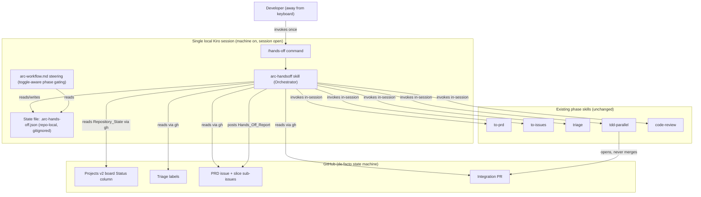

# Design Document: Hands-Off Mode

## Overview

Hands-off mode adds a persistent on/off toggle to the Arc workflow that lets the orchestrator auto-advance through the five mechanical middle phases (PRD, Issues, Triage, Build, Review) without the human invoking each one. It exists to cover a short away-from-keyboard window on the user's local machine while the session stays open.

Like the rest of Arc, this feature is **markdown-driven**: there is no compiled code, no daemon, and no build step. "The orchestrator" is a new skill (`arc-handsoff`) plus a small addition to the always-on workflow steering. The agent runs turn-by-turn inside a single open Kiro session; "hands-off" means the orchestrator chains skill invocations across turns without stopping to ask the user, rather than any background process.

The de-facto state machine lives in GitHub. The orchestrator reads the GitHub Projects v2 board `Status` column, triage labels, and pull request state (collectively the `Repository_State`) via the `gh` CLI to determine the current phase, then invokes the next phase's skill in-session. It loops until a stop condition fires, then posts a single come-back artifact — the `Hands_Off_Report` — to GitHub.

This design covers:

- The persistent toggle mechanism in a system with no runtime config service (Requirement 1)
- The `arc-handsoff` orchestrator skill and its steering hook (Requirement 2)
- The state→phase detection decision table and the auto-advance control loop (Requirements 2, 3)
- Non-blocking park semantics for HITL slices and phase failures (Requirements 5, 6)
- Preservation of the existing merge-stop (Requirement 7)
- The `Hands_Off_Report` structure and how it is posted (Requirement 8)
- Error and edge handling, plus explicit limitations and non-goals

Two human-only boundaries are preserved by design: alignment is reached through the Grill phase **before** the mode is engaged (Requirement 3), and the integration pull request is opened but **never merged** (Requirement 7).

## Architecture

The orchestrator is a thin control layer. It owns no domain logic of its own — it reads GitHub state, decides the next phase, and delegates the actual work to the existing phase skills. Each phase skill behaves identically whether hands-off mode is on or off; the only difference is who pulls the trigger between phases (the human when off, the orchestrator when on).

### C4 Container view



### Component responsibilities

- **`/hands-off` command** — toggles the mode. With no argument it turns the mode on and enters the control loop in the same session; with the argument `off` it turns the mode off and does nothing else (Requirements 1.5, 1.6).
- **`arc-handsoff` skill (Orchestrator)** — owns the control loop: read state, detect phase, invoke the next skill, re-read, continue or stop. It collects parked items and assembles the report (Requirements 2, 3, 5, 6, 8).
- **State file** — the persistent representation of the toggle (Requirement 1).
- **`arc-workflow.md` steering hook** — makes the existing always-on flow toggle-aware: when the mode is off it waits for the human between phases (today's behavior); when on it hands control to the orchestrator (Requirement 1.3).
- **Phase skills** — unchanged. The orchestrator invokes them exactly as a human would.
- **GitHub** — the single source of truth for "where are we." The orchestrator never keeps a private progress counter; it re-derives the phase from `Repository_State` on every loop iteration (Requirement 2.1).

## Components and Interfaces

### 1. The toggle mechanism (Requirement 1)

The toggle is represented by a single repo-local state file: `.arc-hands-off.json` at the repository root.

- **On** — the file exists and contains `{"state": "on"}`.
- **Off** — the file is absent, or contains `{"state": "off"}`.
- **Default** — absent means off, so a repo that has never seen the command defaults to off with no setup (Requirement 1.4).
- **Persistence** — the file lives on disk, so the state survives across workflow invocations until the command changes it (Requirement 1.2).

The file is added to `.gitignore`. It is machine-local session state, not shared configuration, so it must never be committed and must never be picked up by the skill sync hook (which copies only `.kiro/skills/*` and `arc-workflow.md`, leaving a repo-root state file untouched).

`/hands-off` interface:

- `/hands-off` → write `{"state": "on"}`, then run the control loop (Requirement 1.5).
- `/hands-off off` → write `{"state": "off"}` (or delete the file), then stop (Requirement 1.6).

The name "hands-off" is deliberately distinct from Kiro's tool-approval autonomy mode (see the glossary in `requirements.md`).

### 2. Phase detection from Repository_State (Requirement 2.1)

On each loop iteration the orchestrator runs a small set of `gh` / `gh api graphql` reads and classifies the result against the decision table below. The board `Status` option IDs and the project node ID come from `docs/agents/project-board.md`; the triage label strings come from `docs/agents/triage-labels.md`.

Reads performed:

- The PRD issue: the `tracking`-labelled issue for this work (or its absence).
- The PRD issue's sub-issues and each one's triage label.
- Open pull requests whose body contains `Closes #<prd>` (the integration PR).
- The grill-complete proxy: presence of a non-trivial `CONTEXT.md`.

Decision table (current phase → next action):

| Observed Repository_State | Current phase | Next action |
| --- | --- | --- |
| No `CONTEXT.md` (or trivially empty) **and** no PRD issue | Grill not done | **Stop** — park `grill` as "requires the human" (Requirement 3.2) |
| Grill proxy present, no PRD issue exists | Ready to start | Invoke `to-prd` — begin at PRD (Requirement 3.3) |
| PRD issue exists, has no sub-issues | PRD done | Invoke `to-issues` |
| Sub-issues exist, one or more lack a `ready-for-agent`/`ready-for-human` label (still `needs-triage`/`needs-info`/unlabelled) | Issues done | Invoke `triage` |
| Every sub-issue triaged (`ready-for-agent` or `ready-for-human`), no open integration PR | Triage done | Invoke `tdd-parallel` (Build) |
| Open integration PR exists, not yet reviewed | Build done | Invoke `code-review` (Review) |
| Integration PR reviewed clean (Review completed) | Review done | **Stop** auto-advancement (Requirement 2.4) |
| State matches none / more than one row (contradictory signals) | Ambiguous | **Stop** — park `phase-detection` as "ambiguous state" (see Error Handling) |

The orchestrator always advances in the fixed order PRD → Issues → Triage → Build → Review (Requirement 2.3). Because the next action is re-derived from state every iteration, a phase that has already completed is simply skipped — for example, if an integration PR already exists, detection lands on the Review row and Build is not re-run.

### 3. The auto-advance control loop (Requirements 2, 3, 4)

The loop runs entirely within the single session in which `/hands-off` was invoked. There is no background process; when the session ends the loop ends with it (Requirements 4.1, 4.2, 4.3).

```text
command hands_off(arg):
    if arg == "off":
        write_state("off")            # Req 1.6
        return                         # no loop

    write_state("on")                  # Req 1.5

    # Grill-first precondition gate (Req 3.1, 3.2)
    if not grill_complete_proxy():
        park(kind="phase-failure", ref="grill",
             reason="Grill has not reached shared understanding; alignment needs the human",
             disposition="park-and-wait")
        report()
        return

    parked = []                        # in-session source of truth for the report

    loop:
        state = read_repository_state()        # gh + gh api graphql   (Req 2.1)
        phase = detect_phase(state)            # decision table        (Req 2.1, 2.3)

        if phase == REVIEW_COMPLETE:           # Req 2.4
            break
        if phase == AMBIGUOUS:                 # Error Handling
            parked += park(kind="phase-failure", ref="phase-detection",
                           reason="Repository_State did not match a single known phase",
                           disposition="park-and-wait")
            break

        result = invoke_skill(next_skill(phase))   # in-session, no human (Req 2.2)

        # Park-and-continue: HITL slices skipped by tdd-parallel during Build (Req 5)
        parked += result.parked_items

        # Park-and-wait: a phase genuinely failed (Req 6)
        if result.failed:
            parked += park(kind="phase-failure", ref=phase,
                           reason=result.failure_reason,
                           disposition="park-and-wait")
            break                              # never retry this session (Req 6.4)

    report(parked)                             # Req 8
```

Key properties of the loop:

- The grill gate runs once, before the loop, and can only stop — it never invokes grill (Requirement 3.1).
- Auto-advancement begins at the PRD phase when the gate passes (Requirement 3.3).
- The orchestrator never blocks on a question. Any decision needing the absent human's judgment becomes a parked item, and the orchestrator declines to make it (Requirement 5.4).
- A failed phase parks-and-waits and is not retried in the same session (Requirements 6.1, 6.4).

### 4. Park semantics (Requirements 5, 6)

The orchestrator distinguishes two dispositions:

- **Park_And_Continue** — used for HITL slices during Build. `tdd-parallel` already filters out `[HITL]` / `ready-for-human` slices and builds only the AFK slices; the orchestrator records each skipped HITL slice as a parked item and keeps going with the remaining automatable work (Requirements 5.1, 5.2, 5.3).
- **Park_And_Wait** — used for a genuine phase failure: a middle phase errored, Build could not bring an AFK slice to passing, or Review flagged a blocking issue. The orchestrator records the item and stops auto-advancement (Requirements 6.1, 6.2, 6.3).

`Parked_Item` data shape:

```json
{
  "kind": "hitl-slice",
  "ref": "#142",
  "reason": "Requires manual OAuth app registration before implementation",
  "disposition": "park-and-continue"
}
```

- `kind` — one of `hitl-slice`, `afk-incomplete`, `phase-failure`, `review-blocker`, `decision-deferred`.
- `ref` — an issue reference (`#N`) for slice-level items, or a phase name (`grill`, `build`, `review`, `phase-detection`) for phase-level items.
- `reason` — a single-line explanation (Requirements 5.3, 6.2, 6.3).
- `disposition` — `park-and-continue` or `park-and-wait`.

Where parked items are recorded:

- **In-memory list during the session** is the authoritative source for the report. This is the only record guaranteed correct regardless of network state.
- **GitHub mirrors** are durable but secondary: HITL slices already carry the `ready-for-human` label as their natural park marker (no extra label is invented), and every parked item is written into the `PARKED` section of the `Hands_Off_Report` comment, which survives the session ending.

### 5. Merge-stop preservation (Requirement 7)

The orchestrator adds **no** merge or push capability. Shipping is delegated entirely to the existing Build phase:

- When Build completes its automatable AFK slices, `tdd-parallel` pushes the PRD/integration branch and opens the single integration PR with `Closes #<prd>` in the body, then stops — exactly as it does today, governed by `docs/agents/ship-style.md` (Requirement 7.1).
- The orchestrator only reads the resulting PR state to advance to Review. It never calls `git merge`, never pushes to the `Default_Branch`, and leaves the integration PR unmerged (Requirements 7.2, 7.3).
- Because the orchestrator reuses the same `tdd-parallel` → `ship-style` path that a manual run uses, the merge-stop applies identically whether hands-off mode is on or off (Requirement 7.4).

### 6. The Hands_Off_Report (Requirement 8)

When auto-advancement stops — for any reason: Review complete, phase failure, grill gate, or ambiguous state — the orchestrator produces one `Hands_Off_Report` (Requirement 8.1). It is assembled from the run's results plus the in-memory parked list:

- **DID** — the completed AFK slices and the contents of the integration PR (Requirement 8.2), read back from the merged slice list and the PR body.
- **PARKED** — every `park-and-continue` HITL slice and every `park-and-wait` failed phase, each with its one-line reason (Requirement 8.3), rendered from the parked list.
- **READ & MERGE** — the link to the integration PR (Requirement 8.4), so the human can review and merge from their phone.

It is posted as a comment on the PRD issue (primary), falling back to the integration PR body if the PRD issue cannot be resolved (Requirement 8.5). The PRD issue is preferred because it is stable across the whole run and exists even when no PR was opened (for example, when the grill gate stops the run before Build).

Report markdown template:

```markdown
## Hands-Off Report

Run stopped: <reason — Review complete | phase failure | grill gate | ambiguous state>
Stopped at: <ISO-8601 timestamp>

### DID

Integration PR: <url or "none opened">

Completed AFK slices (merged into the integration branch):

- #<n> — <slice title>
- #<n> — <slice title>

### PARKED

- [HITL] #<n> — <slice title> — <one-line reason>
- [FAILED: <phase>] — <one-line reason>

### READ & MERGE

- Review and merge: <integration PR url>
- Nothing reached the default branch; the merge is yours.
```

If a section has no entries (for example, no parked items), it states "None" rather than being omitted, so the human can tell the difference between "nothing parked" and "report truncated."

## Data Models

The feature has no database and no runtime objects. Its "data models" are three small, file- and GitHub-backed shapes the orchestrator reads and writes.

### Hands-off state file

The persistent toggle (Requirement 1). Repo-local, gitignored, at the repository root as `.arc-hands-off.json`.

```json
{
  "state": "on"
}
```

- `state` — `"on"` or `"off"`. The file being absent is equivalent to `"off"` and is the default (Requirements 1.2, 1.4).

### Parked_Item

An in-memory record collected during the run and rendered into the report (Requirements 5, 6).

```json
{
  "kind": "hitl-slice",
  "ref": "#142",
  "reason": "Requires manual OAuth app registration before implementation",
  "disposition": "park-and-continue"
}
```

- `kind` — one of `hitl-slice`, `afk-incomplete`, `phase-failure`, `review-blocker`, `decision-deferred`.
- `ref` — an issue reference (`#N`) for slice-level items, or a phase name (`grill`, `build`, `review`, `phase-detection`) for phase-level items.
- `reason` — a single-line explanation (Requirements 5.3, 6.2, 6.3).
- `disposition` — `park-and-continue` (Requirement 5) or `park-and-wait` (Requirement 6).

### Repository_State (read model)

Not stored by this feature — assembled on each loop iteration from `gh` reads and consumed by the decision table (Requirement 2.1). Conceptual shape:

```json
{
  "grillProxyPresent": true,
  "prdIssue": { "number": 120, "labels": ["tracking"] },
  "subIssues": [
    { "number": 121, "label": "ready-for-agent" },
    { "number": 142, "label": "ready-for-human" }
  ],
  "integrationPr": { "number": 130, "state": "open", "reviewed": false }
}
```

- `grillProxyPresent` — whether a non-trivial `CONTEXT.md` or an existing PRD issue indicates grill is done (Requirement 3).
- `prdIssue` — the `tracking`-labelled PRD issue, or `null` if none exists.
- `subIssues` — each slice and its triage label, used to decide Issues vs Triage vs Build.
- `integrationPr` — the open integration PR and whether it has been reviewed, used to decide Build vs Review vs stop.

## Error Handling

The orchestrator's default posture while the human is away is: **stop safely and park, never guess and never thrash.**

- **Ambiguous state (cannot determine phase)** — if `Repository_State` matches no row of the decision table, or matches more than one in a contradictory way, the orchestrator does not guess. It parks a `phase-detection` item (`park-and-wait`) and stops, then reports (Requirement 5.4). Example: a PRD issue with sub-issues but also an open integration PR whose `Closes` set does not match the sub-issues.
- **No AFK slices exist** — if every slice is `ready-for-human`, Build has nothing to fan out. `tdd-parallel` reports zero AFK work; the orchestrator records the HITL slices as `park-and-continue` items, notes that no integration PR could be opened, and stops with a report (no PR link in READ & MERGE).
- **Integration PR already exists** — detection lands on the Review row, so Build is skipped and the orchestrator advances straight to `code-review`. It never opens a second PR or re-runs Build.
- **Grill has not happened** — the precondition gate stops before the loop and parks `grill` as "requires the human" (Requirements 3.1, 3.2). The grill proxy (a non-trivial `CONTEXT.md` or an existing PRD issue) is conservative: when in doubt it stops rather than automate alignment.
- **Phase failure mid-run** — any middle phase that errors triggers `park-and-wait`; the orchestrator stops at that phase and does not retry it in the same session (Requirements 6.1, 6.4). The underlying skill's own RCA (for example `tdd-parallel`'s structured halt) is captured into the parked item's reason.
- **Review flags a blocking issue** — `code-review` surfaces blocking findings; the orchestrator records a `review-blocker` parked item and stops (Requirement 6.3). It does not apply review fixes autonomously, because `code-review` itself gates fixes behind human approval.
- **State-file or network read failure** — if `gh` reads fail, the orchestrator cannot determine the phase; it treats this as ambiguous, stops, and reports the read failure as the reason.

## Testing Strategy

### Why property-based testing does not apply

This feature is markdown-driven orchestration with no executable runtime. The orchestrator is a side-effect-only control layer: it reads GitHub state and invokes other skills. There is no pure function that takes an input and returns a value to assert a universal property over, so property-based testing is not the right tool here (consistent with the sibling `arc-kiro-workflow` design and the Arc convention that skills are agent instructions, not code). The Correctness Properties section is therefore intentionally omitted.

The closest thing to testable logic — the state→phase decision table — is a lookup the agent performs by following the skill instructions, not a compiled function with a test harness. It is validated by scenario walkthroughs rather than generated inputs.

### How this feature is verified instead

- **Decision-table scenario tests (example-based).** Walk the decision table against concrete `Repository_State` fixtures and confirm the orchestrator selects the expected next action: fresh repo with grill done → `to-prd`; PRD with no sub-issues → `to-issues`; partially triaged → `triage`; fully triaged, no PR → `tdd-parallel`; open PR → `code-review`; reviewed → stop. Cover each Error Handling row (ambiguous, no AFK slices, PR already exists, grill missing) as its own scenario.
- **Toggle behavior checks.** Verify default-off with no state file, that `/hands-off` writes on and `/hands-off off` writes off, that the state persists across invocations, and that the state file is gitignored and not swept by the skill sync hook (Requirement 1).
- **Park-list assembly checks.** Given a mixed run (some AFK slices merged, one HITL skipped, one phase failed), confirm the `Hands_Off_Report` DID / PARKED / READ & MERGE sections render correctly and the report is posted to the PRD issue (Requirement 8).
- **Merge-stop regression.** Confirm the orchestrator path introduces no `git merge` or push-to-default capability and that the integration PR is left unmerged in both modes (Requirement 7).

These are example/integration-style checks executed as guided walkthroughs against the `gh` CLI and fixture issues, with a small number of representative cases each — not 100-iteration property runs.

## Architecture Decision Records

### ADR-001: State-file toggle vs label-based toggle

**Context.** The mode must persist across invocations and default to off (Requirement 1), but Arc has no runtime config service.

**Decision.** Represent the toggle as a repo-local, gitignored JSON file (`.arc-hands-off.json`) at the repository root.

**Alternatives considered.** A label on the PRD issue, or a GitHub repo variable. Rejected because both require a network round-trip just to read the mode, couple the toggle to a specific issue, and pollute issue metadata. A local file is instant to read, repo-scoped, and matches the single-local-session blast radius of Requirement 4.

**Consequences.** Reading the mode is a trivial local file check. The file must be gitignored and kept out of the skill sync hook's scope. The toggle is per-checkout, which is exactly the intended granularity.

### ADR-002: Single-session loop vs background process

**Context.** Hands-off must cover a short away-from-keyboard window on the user's local machine (Requirement 4).

**Decision.** Run the auto-advance loop in-session, turn by turn, within the same Kiro session that invoked `/hands-off`. When the session ends, the loop ends.

**Alternatives considered.** A daemon, cron job, or headless runner. Rejected because Arc is a skill/steering pipeline with no background execution available, and because tying the run to an open local session keeps the blast radius identical to a manual run (Requirement 4.3).

**Consequences.** The machine must stay on and the session open for the duration. There is no resume-after-close; a new `/hands-off` invocation simply re-derives the phase from GitHub state and continues from wherever the work actually is.

### ADR-003: Park-and-continue vs halt-all on exceptions

**Context.** While the human is away, some slices need a human (HITL) and some phases genuinely fail (Requirements 5, 6).

**Decision.** Two dispositions. HITL slices are parked-and-continued so automatable work still gets done; genuine phase failures are parked-and-waited so the workflow stops rather than thrash.

**Alternatives considered.** Halt the entire run on the first exception. Rejected because it would waste the away window — a single HITL slice would block all the AFK work that could have shipped.

**Consequences.** The orchestrator must classify each exception as "needs a human but the rest can proceed" versus "this phase cannot proceed." Misclassification risk is mitigated by stopping (the safe default) whenever the situation is ambiguous.

### ADR-004: State-derived phase detection vs an explicit progress counter

**Context.** The orchestrator must know the current phase on each iteration (Requirement 2.1).

**Decision.** Re-derive the phase from `Repository_State` (board Status, labels, PR state) on every loop iteration. Keep no private progress counter.

**Alternatives considered.** Track progress in the state file. Rejected because a private counter can drift from reality if the human edits issues or the board between turns; GitHub is already the de-facto state machine and is authoritative.

**Consequences.** Detection is idempotent and self-correcting — completed phases are naturally skipped, and an externally-opened PR is picked up without special handling. The cost is a few `gh` reads per iteration, which is negligible.

### ADR-005: Reuse existing gates; add no new verifier

**Context.** Auto-advancing through Build and Review relies on the existing quality gates: `tdd-parallel`'s agent-written tests and `code-review`.

**Decision.** Hands-off mode reuses these gates unchanged and intentionally adds no new verification step.

**Alternatives considered.** Add an independent verifier (for example, a coverage or mutation gate) before opening the integration PR. Rejected for this feature's scope — it is a separate concern and would expand the blast radius beyond "automate the human's between-phase clicks."

**Consequences.** The known green-but-wrong risk of agent-written tests (see Limitations) is inherited as-is. This is an accepted, documented trade-off, not an oversight.

## Limitations / Non-Goals

### Known limitation: the gates are a weak self-verification signal

The only correctness gates in the pipeline are `tdd-parallel`'s tests — which are written by the same agents implementing the slices — and `code-review`. Agent-written tests are a weak self-verification signal: a slice can be "green but wrong" when the agent writes a test that passes against its own incorrect implementation. Hands-off mode reuses these existing gates and **intentionally does not add a new verifier** (see ADR-005). Running unattended raises the stakes of this limitation because the human is not watching each phase land. This is documented here as a known, accepted risk for this feature — not something this design solves. The `Hands_Off_Report` and the preserved merge-stop are the mitigations: nothing reaches the default branch without human review.

### Non-goals

- **No autonomous merge.** The integration PR is opened and left for the human (Requirement 7).
- **No Kiro Web / cloud execution.** Hands-off is a local-session feature only (Requirement 4).
- **No scheduling, cron, or daemon.** There is no background process; the loop runs only inside an open session (ADR-002).
- **No headless operation.** The mode requires an open, interactive local session that the user started.
- **No grill automation.** The Grill phase is human-only and is never auto-advanced (Requirement 3.1).
