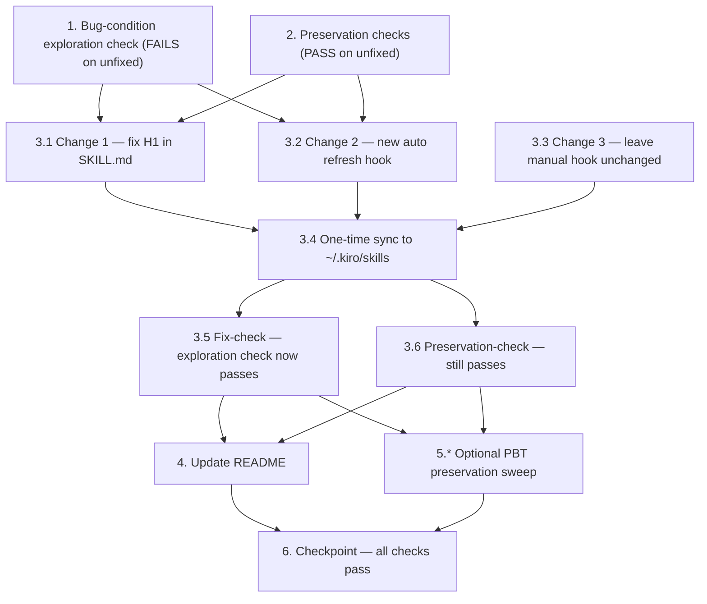

# Implementation Plan: Setup Arc Skill Availability

## ⚠️ MANDATORY - READ BEFORE EVERY TASK ⚠️

**YOU MUST FOLLOW THESE RULES FOR EVERY TASK:**

1. **Shell Commands**: Use `controlPwshProcess` ONLY. NEVER use `executePwsh`.
2. **Gap Analysis**: Perform TWO gap analysis passes BEFORE marking any task complete.
3. **Show Your Work**: Gap analysis must be visible in your response.

If you skip any of these, you have violated the protocol.

---

## Overview

This plan fixes the `setup-arc` skill availability bug using the bug-condition methodology. The `setup-arc` skill only resolves reliably inside the `arc-workflow` source repo because its only cross-project delivery path is a manual, `userTriggered` sync hook. In any other workspace — on a machine where that hook was never run, or was last run before `setup-arc` existed — the skill fails to resolve, Phase 0 cannot invoke it, and the steering pre-flight check warns about an unresolved reference.

The fix follows design.md Option A (make native `~/.kiro/skills/` delivery reliable):

- **Change 1**: Correct the leftover H1 `# Setup ZSL Superpowers` → `# Setup Arc` in `setup-arc/SKILL.md` (frontmatter untouched).
- **Change 2**: Add a new automatic, idempotent `promptSubmit` hook (`sync-skills-to-global-auto.kiro.hook`) that runs the same `Copy-Item` the manual hook uses, once per session, from the source repo.
- **Change 3**: Leave the manual `sync-skills-to-global.json` unchanged (escape hatch).
- **One-time action**: Run the sync once so the corrected `setup-arc` lands in `~/.kiro/skills/` immediately.
- **README**: Update the "Modifying a skill" section to mention the new automatic refresh hook.

Following the bug-condition method: Task 1 writes the exploration check that FAILS on the unfixed state (proving the bug), Task 2 writes preservation checks that PASS on the unfixed state, then the fix is applied and both are re-verified.

## Development Principles

**IMPORTANT**: Follow these principles strictly during implementation:

1. **Build ugly and working before making it clean**
   - Get it working first
   - Refactor later if needed
   - Don't optimize prematurely

2. **If something isn't specified, ask - don't invent**
   - No assumptions
   - No "improvements"
   - No "I noticed we could also..."

3. **Build exactly what's specified. Nothing more.**
   - No extra features
   - No extra abstractions
   - No extra config options

4. **Stop and ask if stuck for 10+ minutes**
   - Don't waste time debugging hallucinated APIs
   - Use Context7 to check library docs
   - Ask for clarification on ambiguous requirements

5. **Property tests are optional for MVP**
   - Tasks marked with `*` can be skipped
   - Focus on getting core functionality working
   - Add comprehensive tests in v2

## Non-Requirements (What NOT to Build)

To maintain simplicity and focus, this implementation explicitly **DOES NOT** include:

❌ Do NOT package the Arc skills as a Claude plugin or marketplace manifest (Option B was rejected — it does not feed Kiro's `~/.kiro/skills/` resolution)

❌ Do NOT edit the `zsl-skills` `.claude-plugin` manifests (`plugin.json`, `marketplace.json`) — preserves Req 3.3

❌ Do NOT change any skill's scaffolding logic (issue tracker, triage labels, domain docs, ship style, project board) — preserves Req 3.6

❌ Do NOT change the `setup-arc` frontmatter `name` or `description` — only the H1 line changes (preserves Req 3.5)

❌ Do NOT modify the existing manual `sync-skills-to-global.json` hook — preserves Req 3.2

❌ Do NOT build a new Kiro Power packaging, versioning, or publishing pipeline

❌ Do NOT add config options or abstractions "for future flexibility"

**System Characteristics:**

✅ A corrected H1 heading in `.kiro/skills/setup-arc/SKILL.md` (`# Setup Arc`)

✅ A new automatic, idempotent `.kiro.hook` that refreshes `~/.kiro/skills/` once per session from the source repo

✅ The manual sync hook preserved byte-for-byte as an escape hatch

✅ A one-time sync so `setup-arc` is resolvable in other projects immediately

✅ A README "Modifying a skill" update documenting the automatic refresh hook

✅ All verification is Windows PowerShell (`Test-Path`, content checks)

## Context7 MCP Usage (CRITICAL)

This bugfix involves **no external code libraries**. The work consists of:

- Editing a markdown skill file (`SKILL.md`)
- Creating a JSON `.kiro.hook` hook file (Kiro-native schema, mirrored from an existing in-repo hook)
- Running a PowerShell `Copy-Item` command for the one-time sync and verification

**No Context7 library queries are required for this feature.** The `.kiro.hook` schema is taken directly from the repo's existing `kiro-recall-session-start.kiro.hook` and `sync-skills-to-global.json`, not from any external API. If any question about Kiro hook schema fields arises, mirror the existing in-repo hooks rather than guessing.

---

## Tasks

- [x] 1. Write bug-condition exploration check (BEFORE the fix)
  - **Property 1: Bug Condition** - setup-arc does not resolve from a non-arc-workflow workspace
  - **CRITICAL**: This check MUST FAIL on the unfixed state - failure confirms the bug exists
  - **DO NOT attempt to fix the check or the code when it fails**
  - **NOTE**: This check encodes the expected behavior - it will validate the fix when it passes after implementation
  - **GOAL**: Surface counterexamples that demonstrate the bug exists
  - **Scoped PBT Approach**: This is a deterministic, file-presence bug, so scope the property to the concrete failing case — `skillRef == "setup-arc"` with `~/.kiro/skills/setup-arc/` absent — rather than generating a broad input space
  - Simulate a stale/clean global skill set: confirm the asymmetry where other Arc skills are present globally but `setup-arc` is not. Using `controlPwshProcess`, run a check equivalent to:
    - `Test-Path $HOME/.kiro/skills/setup-arc/SKILL.md` — expect `False` on the unfixed machine state (counterexample: `setup-arc` absent from global skill set)
    - Confirm other Arc skills resolve while `setup-arc` does not (e.g. `Test-Path $HOME/.kiro/skills/tdd`, `triage`, `diagnose` return `True`) — reproduces the exact reported asymmetry from design Stale-sync Edge Case
  - Assert that from a non-`arc-workflow` workspace, the steering "Pre-flight: Unknown skill reference check" would surface a warning for `setup-arc` because it resolves in neither `.kiro/skills/` nor `~/.kiro/skills/`
  - Run the check on the UNFIXED state (no auto-hook, global copy missing)
  - **EXPECTED OUTCOME**: Check FAILS / reports `setup-arc` unresolved (this is correct - it proves the bug exists)
  - Document the counterexamples found (e.g. "`Test-Path $HOME/.kiro/skills/setup-arc/SKILL.md` returns False while `tdd`/`triage`/`diagnose` return True; pre-flight warns for setup-arc")
  - Mark task complete when the check is written, run, and the failure is documented
  - _Bug_Condition: isBugCondition(input) where skillRef == "setup-arc" AND workspace IS NOT arc-workflow-source-repo AND "setup-arc" NOT IN globalSkills_
  - _Requirements: 1.1, 1.2, 1.3, 1.4_

- [x] 2. Write preservation checks (BEFORE the fix)
  - **Property 2: Preservation** - non-buggy behavior is unchanged
  - **IMPORTANT**: Follow observation-first methodology — observe the UNFIXED behavior first, then assert it
  - Observe and record current state on the UNFIXED repo, using `controlPwshProcess`:
    - Local resolution inside `arc-workflow`: confirm `.kiro/skills/setup-arc/SKILL.md` exists locally (`Test-Path .kiro/skills/setup-arc/SKILL.md` → `True`) — baseline for Req 3.1
    - Manual hook content: capture the exact bytes/contents of `.kiro/hooks/sync-skills-to-global.json` (e.g. record its hash) — baseline for Req 3.2
    - zsl plugin manifests untouched: confirm `c:\Dev\zsl-skills\.claude-plugin\plugin.json` and `marketplace.json` exist and record their state — baseline for Req 3.3
    - Other global Arc skills resolve: `Test-Path $HOME/.kiro/skills/tdd`, `triage`, `diagnose` → `True` — baseline for Req 3.4
    - Frontmatter baseline: capture the current `name: setup-arc` line and full `description:` string from `setup-arc/SKILL.md` — baseline for Req 3.5
    - Scaffolding body baseline: note the skill body (Process sections, templates, bundled resource links) below the H1 — baseline for Req 3.6
  - Write these observations as explicit preservation assertions to re-run after the fix
  - Run the checks on the UNFIXED state
  - **EXPECTED OUTCOME**: All preservation checks PASS (this confirms the baseline behavior to preserve)
  - Mark task complete when the checks are written, run, and passing on the unfixed state
  - _Preservation: For all inputs where isBugCondition is false, fixed result == original result_
  - _Requirements: 3.1, 3.2, 3.3, 3.4, 3.5, 3.6_

- [x] 3. Apply the fix (Option A — reliable native `~/.kiro/skills/` delivery)

  - [x] 3.1 Change 1 — Correct the branding H1 in setup-arc/SKILL.md
    - File: `c:\Dev\arc-workflow\.kiro\skills\setup-arc\SKILL.md`
    - Replace the H1 line `# Setup ZSL Superpowers` with `# Setup Arc`
    - Do NOT touch the frontmatter `name: setup-arc` or `description:` — only the single H1 line changes
    - Do NOT touch the skill body (Process sections, templates, bundled resource links)
    - _Bug_Condition: secondary defect — H1 mismatch shown on every read of SKILL.md_
    - _Expected_Behavior: SKILL.md shows an H1 consistent with Arc branding (`# Setup Arc`)_
    - _Preservation: frontmatter name+description and skill body unchanged_
    - _Requirements: 2.5, 3.5, 3.6_

  - [x] 3.2 Change 2 — Create the automatic idempotent global-refresh hook
    - File (new): `c:\Dev\arc-workflow\.kiro\hooks\sync-skills-to-global-auto.kiro.hook`
    - Use the `.kiro.hook` JSON schema from `kiro-recall-session-start.kiro.hook` (fields: `enabled`, `name`, `description`, `version`, `when`, `then`)
    - Set `enabled: true`, `when.type: "promptSubmit"` (fires automatically at session start, runs once per session)
    - Set `then.type: "runCommand"` (deterministic file copy — `runCommand` is correct here, matching the manual hook's `then.type`, NOT the kiro-recall `askAgent`)
    - Set `then.command` to the SAME PowerShell copy the manual hook uses: `Copy-Item -Recurse -Force .kiro/skills/* $HOME/.kiro/skills/; Copy-Item -Force .kiro/steering/arc-workflow.md $HOME/.kiro/steering/arc-workflow.md`
    - Idempotency: overwrite-with-force of identical content is harmless to repeat
    - _Bug_Condition: isBugCondition(input) — manual-only, forgettable/stale delivery into ~/.kiro/skills_
    - _Expected_Behavior: setup-arc is placed into ~/.kiro/skills automatically from the source repo, eliminating the staleness/forgetting failure mode_
    - _Preservation: only writes into ~/.kiro/skills from the canonical repo; preserves 3.1–3.4_
    - _Requirements: 2.1, 2.4_

  - [x] 3.3 Change 3 — Leave the manual sync hook unchanged
    - File: `c:\Dev\arc-workflow\.kiro\hooks\sync-skills-to-global.json`
    - Make NO edits — the manual `userTriggered` hook is preserved verbatim as the documented escape hatch
    - _Expected_Behavior: manual hook continues to copy workspace skills + steering into ~/.kiro when triggered_
    - _Preservation: manual sync escape hatch unchanged_
    - _Requirements: 3.2_

  - [x] 3.4 One-time action — Refresh the global skill set now
    - Using `controlPwshProcess`, run the sync once from the `arc-workflow` repo so the corrected `setup-arc` lands in `~/.kiro/skills/setup-arc/` immediately: `Copy-Item -Recurse -Force .kiro/skills/* $HOME/.kiro/skills/; Copy-Item -Force .kiro/steering/arc-workflow.md $HOME/.kiro/steering/arc-workflow.md`
    - _Expected_Behavior: setup-arc resolvable in all other projects right away_
    - _Requirements: 2.1, 2.2_

  - [x] 3.5 Verify bug-condition exploration check now passes (fix-check)
    - **Property 1: Expected Behavior** - setup-arc resolves from a non-arc-workflow workspace
    - **IMPORTANT**: Re-run the SAME check from Task 1 - do NOT write a new check
    - Using `controlPwshProcess`, confirm `Test-Path $HOME/.kiro/skills/setup-arc/SKILL.md` returns `True`
    - Confirm the copied global `SKILL.md` shows the corrected `# Setup Arc` H1 (e.g. `Select-String -Path $HOME/.kiro/skills/setup-arc/SKILL.md -Pattern '# Setup Arc'`) and does NOT contain `# Setup ZSL Superpowers`
    - Confirm that from a non-`arc-workflow` workspace the steering pre-flight "Unknown skill reference check" would resolve `setup-arc` and emit no warning for it
    - **EXPECTED OUTCOME**: Check PASSES (confirms the bug is fixed)
    - _Expected_Behavior: resolveSkillReference("setup-arc", workspace) == RESOLVED; Phase 0 can invoke; no pre-flight warning_
    - _Requirements: 2.1, 2.2, 2.3, 2.5_

  - [x] 3.6 Verify preservation checks still pass (preservation-check)
    - **Property 2: Preservation** - non-buggy behavior still unchanged
    - **IMPORTANT**: Re-run the SAME checks from Task 2 - do NOT write new checks
    - Manual hook byte-for-byte unchanged (hash matches the Task 2 baseline) — Req 3.2
    - zsl-skills `.claude-plugin` manifests untouched — Req 3.3
    - Other global skills `tdd`/`triage`/`diagnose` still resolve — Req 3.4
    - `setup-arc` frontmatter `name` and `description` identical to the Task 2 baseline; only the H1 line changed — Req 3.5
    - Local `arc-workflow` resolution of `setup-arc` still works — Req 3.1
    - Skill body (Process sections, templates, bundled resource links) unchanged — Req 3.6
    - **EXPECTED OUTCOME**: All preservation checks PASS (confirms no regressions)
    - _Preservation: resolve_fixed(input) == resolve_original(input) for all ¬C inputs_
    - _Requirements: 3.1, 3.2, 3.3, 3.4, 3.5, 3.6_

- [x] 4. Update README "Modifying a skill" section
  - File: `c:\Dev\arc-workflow\README.md`
  - In the "Modifying a skill" subsection, update step 3 ("Run the sync hook from this workspace to propagate") to mention the new automatic refresh hook fires at session start, while keeping the manual install instructions intact
  - Keep the "Global vs local skills" notes consistent (the sync now also runs automatically from this repo)
  - This satisfies the steering rule that README must stay in sync when skills/hooks change
  - _Requirements: 2.4, 3.2_

- [x] 5. Property-based preservation sweep (optional, comprehensive)
  - **Property 2: Preservation** - resolution outcome identical before/after across the input space
  - Generate arbitrary non-`arc-workflow` workspace names; after the refresh, assert `setup-arc` resolves for every one (Property 1, Fix Checking)
  - Generate arbitrary skill names from the existing Arc set plus `setup-zsl-superpowers`; assert resolution outcome is identical before and after the fix for every name except where C made `setup-arc` fail (Property 2, Preservation Checking)
  - Idempotent refresh: run the refresh N times and assert `~/.kiro/skills/setup-arc/` content is identical regardless of N (no duplication, no corruption)
  - This broad sweep is OPTIONAL for MVP — the deterministic checks in Tasks 1, 3.5, and 3.6 already cover the core fix and preservation
  - _Requirements: 2.1, 2.2, 2.3, 2.4, 3.1, 3.2, 3.3, 3.4, 3.5, 3.6_

- [x] 6. Checkpoint - Ensure all checks pass
  - Confirm the Task 1 exploration check now passes (bug fixed) and the Task 2 preservation checks still pass (no regressions)
  - Confirm the new hook is valid JSON with `enabled: true`, a `when` trigger, and a `then.runCommand` whose command matches the manual hook's copy command
  - Confirm the manual hook is identical to its pre-fix content
  - Ask the user if any questions arise
  - _Requirements: 2.1, 2.2, 2.3, 2.4, 2.5, 3.1, 3.2, 3.3, 3.4, 3.5, 3.6_

## Task Dependency Graph



Ordering rationale: the bug-condition exploration check (Task 1) and preservation checks (Task 2) MUST run on the UNFIXED state before any change. Changes 1–3 (Tasks 3.1–3.3) are independent edits; the one-time sync (3.4) depends on Changes 1 and 2 being in place. Fix-check (3.5) and preservation-check (3.6) both depend on the sync. README (Task 4) and the optional PBT sweep (Task 5) follow verification, and the checkpoint (Task 6) closes out.

```json
{
  "waves": [
    {
      "wave": 1,
      "description": "Pre-fix checks on the UNFIXED state (bug-condition method)",
      "tasks": ["1", "2"]
    },
    {
      "wave": 2,
      "description": "Apply the three changes (independent edits)",
      "tasks": ["3.1", "3.2", "3.3"]
    },
    {
      "wave": 3,
      "description": "One-time sync to ~/.kiro/skills",
      "tasks": ["3.4"]
    },
    {
      "wave": 4,
      "description": "Re-verify: fix-check and preservation-check",
      "tasks": ["3.5", "3.6"]
    },
    {
      "wave": 5,
      "description": "README update and optional PBT sweep",
      "tasks": ["4", "5"]
    },
    {
      "wave": 6,
      "description": "Final checkpoint",
      "tasks": ["6"]
    }
  ]
}
```

## Notes

- **Bug-condition methodology**: Task 1 is the exploration check that must FAIL on the unfixed state (proving `setup-arc` is absent from `~/.kiro/skills/`). It is re-run as the fix-check in Task 3.5 — do not write a new check there. Task 2 captures preservation baselines that must PASS before and after the fix; re-run in Task 3.6.
- **Hook `then.type` decision**: the new auto hook uses `runCommand` (a deterministic file copy), matching the manual hook's `then.type` — not the kiro-recall hook's `askAgent`. Only the schema/trigger style (`enabled`/`version`/`when.type: promptSubmit`) is borrowed from `kiro-recall-session-start.kiro.hook`.
- **Source-of-truth scope**: the auto hook only ever fires inside the `arc-workflow` repo, so it never writes to `~/.kiro/skills/` from a non-source workspace. This keeps preservation requirements 3.1–3.4 intact.
- **Idempotency**: `Copy-Item -Force` overwrites global copies with identical content on repeat runs — harmless to repeat, identical to the manual hook's behavior.
- **All shell verification is Windows PowerShell** and must run via `controlPwshProcess` (never `executePwsh`), per the mandatory protocol.
- **Do NOT modify** the published `c:\Dev\zsl-skills` repo or its `.claude-plugin` manifests (preserves Req 3.3).

## Post-implementation Correction (2026-06-04)

A defect was found during live testing **after** this spec was marked complete. It is recorded here so the design/tasks match reality; the fix was applied as a direct patch (no new spec).

- **Defect**: The auto-refresh hook (`sync-skills-to-global-auto.kiro.hook`) and the manual hook (`sync-skills-to-global.json`) set `then.command` to a bare `Copy-Item …` string. Kiro's hook runner executes `runCommand` through **cmd.exe** on this machine, and `Copy-Item` is a PowerShell cmdlet — so every session-start fire failed with `'Copy-Item' is not recognized as an internal or external command`. The propagation this spec set out to fix therefore never actually ran via the auto hook.
- **Root cause**: The design (Change 2) and Tasks 3.2/3.4 assumed the copy command runs in a PowerShell host. That assumption was wrong for a cmd-shell environment. The Task 1/3.5 verification used `controlPwshProcess` (a PowerShell host), which masked the defect because the command was never exercised through cmd the way the hook runs it.
- **Fix applied**: Both hooks now wrap the copy in `powershell -NoProfile -Command "…"` so it runs in a PowerShell host regardless of the parent shell. Verified by reproducing the cmd path (`cmd /c`) → exit 0, and confirming `~/.kiro/skills/setup-arc/SKILL.md` is refreshed.
- **Lesson for future hook specs**: verify `runCommand` hook commands through the **actual hook execution shell** (cmd on Windows), not only through a PowerShell host, or make the command shell-agnostic by invoking the interpreter explicitly.

